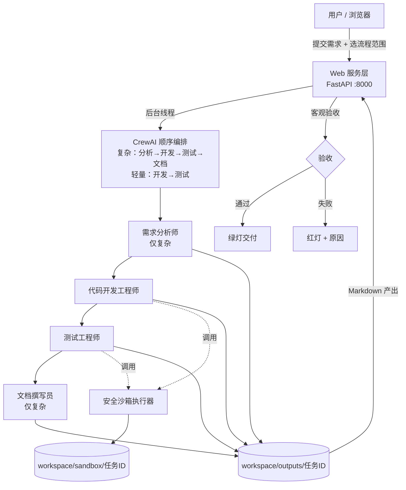

# 多角色协作任务 Agent —— 项目总结

> 一句话定位：把"一句话需求"交给多个 AI 角色顺序协作（**流程范围可选：复杂四步 / 轻量两步**），自动产出**经过真实沙箱验证的代码、测试报告与交付文档**，并提供 Web 界面统一管理、运行与迭代。

---

## 一、项目要解决的问题

传统"让 AI 写代码"的痛点是：只有一段代码文本，无法确认是否真能跑、是否测过、需求有没有漏。
本项目用**多角色分工 + 真实执行 + 客观验收**解决这三点：代码必须在沙箱里真的跑起来，测试必须有真实通过率，交付必须通过机器验收而不是"模型自称完成"。

---

## 二、系统架构



### 分层说明

| 层 | 实现 | 职责 |
|---|---|---|
| 交互层 | `static/index.html`（单文件原生 JS） | 选流程范围、提交需求、实时进度、历史任务、脚本运行、文档查看、迭代入口 |
| 服务层 | `web_server.py`（FastAPI） | 任务提交/轮询、文件与文档读取、沙箱运行 API、客观验收、任务血缘与范围持久化 |
| 流程层 | `src/pipelines.py` | 流程范围（复杂/轻量）的唯一定义：步骤、产出文件名、base 文档映射、验收报告定位 |
| 编排层 | CrewAI `Process.sequential` | 按所选范围的步骤严格顺序执行，前一阶段产出作为后一阶段上下文 |
| 角色层 | `src/agents.py` | 四角色人设、目标、工具权限、沙箱纪律（轻量流程只启用其中两个） |
| 任务层 | `src/tasks.py` | 按范围装配任务提示词、产出文件落点、阶段回调；支持"全新/迭代"两种模式 |
| 执行层 | `src/tools/sandbox.py` + `sandbox_runner.py` | AST 静态检查 + 子进程运行时审计钩子，双重防线 |
| 模型层 | `src/config.py` | DeepSeek（OpenAI 兼容接口）配置与密钥校验 |

### 四个角色（复杂流程全部启用，轻量流程只启用开发与测试）

| 角色 | 产出 | 权限 |
|---|---|---|
| 需求分析师 | `01_requirements.md`：功能点、边界异常、技术方案、验收标准 | 无代码执行工具 |
| 代码开发工程师 | 沙箱内真实落盘的 `main.py` 等 + `02_implementation.md` | 沙箱执行工具 |
| 测试工程师 | 独立 `test_main.py` + `03_test_report.md`（用例清单、通过率、缺陷） | 沙箱执行工具 |
| 文档撰写员 | `04_final_report.md`：整合需求/方案/代码/测试的交付报告 | 无代码执行工具 |

上表的文件名前缀按复杂流程编号；轻量流程的产出为 `01_implementation.md` 与 `02_test_report.md`——编号由所选范围的步骤顺序自动派生。

---

## 三、这个项目能干什么

1. **一句话需求 → 按需交付**：可选两种流程范围——**复杂任务**走"需求分析 → 代码开发 → 测试验证 → 文档撰写"四步，产出 4 份文档；**轻量任务**只走"代码开发 → 测试验证"两步，产出实现说明与测试报告，适合写脚本类快速交付。
2. **真实执行，不靠嘴说**：所有代码在隔离沙箱中实际运行，退出码、stdout、stderr 原样回传。
3. **新手友好**：需求写得粗糙也能用——复杂流程的分析师负责把模糊需求问清楚、拆成可验收条目。
4. **Web 一站式管理**：历史任务列表（含轻量标记与迭代血缘）、按流程范围的实时进度条、各阶段产出查看、脚本源码预览。
5. **在线运行与调试**：在页面上直接对历史任务脚本传 stdin 运行（如交互式计算器），无需本地环境。
6. **机器把关交付质量**：流水线跑完不等于成功，必须通过客观验收（主脚本真实落盘 + 该范围的测试报告无失败结论）。
7. **历史任务迭代**：在已完成任务上继续改——继承旧代码与旧文档，增量修改 + 回归测试，产出"版本演进报告"；**范围与迭代可叠加**（轻量任务也能迭代），但仅限同范围迭代。
8. **失败可追溯**：失败任务亮红灯并给出具体原因（哪个信号、哪个文件），历史任务重开服务后仍能按其范围回放验收结论。

---

## 四、关键技术机制

### 1. 安全沙箱（双重防线）

- **第一道：AST 静态检查** —— 执行前扫描源码，拦截危险调用。
- **第二道：运行时审计钩子** —— 子进程先安装 `sys.addaudithook` 再执行用户代码，实时阻断。
- **允许**：网络访问（urllib/requests）、标准库与 venv 第三方库导入、沙箱目录内读写、`os.path`/`os.makedirs` 等正常功能。
- **禁止**：子进程与系统命令、动态库加载、注册表操作、递归删除、读写沙箱目录外文件、`eval/exec` 等逃逸写法。
- **边界**：任务沙箱目录只允许写入，读取额外放开解释器与 venv 目录（保证 import 可用）。

### 2. 客观验收（自动判红灯）

流水线结束 ≠ 交付成功。验收两层判定：

1. 沙箱中必须真实存在开发交付的主脚本（`main.py` 优先，排除 probe/inspect/test 等探测类文件），且非空文件；
2. 该流程范围的测试报告（复杂 `03_test_report.md`、轻量 `02_test_report.md`）不得出现明确失败结论（命中"未通过验收""全部阻塞""通过率 0.0%"等信号）。

不通过即标记失败并写明原因，杜绝"流程跑完就当成功"。

### 3. 历史任务迭代（血缘可追溯）

- 新建任务可带 `base_run_id`：把基线任务的业务代码与正式测试复制进新沙箱；该范围的产出文档按步骤声明复制为 `base_*.md`（复杂：需求分析/测试报告/最终报告；轻量：实现说明/测试报告）。
- 角色切换为迭代模式：变更影响分析 → 在旧代码上增量修改（禁止推倒重写）→ 回归 + 新增测试分组统计 → 版本演进报告。
- 仅支持**同范围迭代**（复杂基线只能在复杂流程内迭代，轻量同理），避免提示词引用基线中不存在的文档。
- 新任务使用新时间戳 ID，**基线任务原封不动**；血缘写入 `iteration.json`、所选范围写入 `run.json`，服务重启后仍可展示"基于 xxx 迭代"，并按其范围回放验收。

### 4. 并发与状态管理

- 同一时刻只允许一个 Crew 运行（`_is_busy()` 检查），避免沙箱环境变量与目录冲突。
- 内存态任务表 + 前台 2 秒轮询；服务重启后对历史任务**实时回放**验收结论（按 `run.json` 记录的范围，旧任务回退复杂流程），状态不失真。

---

## 五、目录结构

```
agentdemo/
├── main.py                     # 命令行入口
├── web_server.py               # FastAPI 服务（提交/轮询/文件/运行/验收/迭代）
├── clean_history.py            # 历史任务清理脚本
├── static/index.html           # 单文件前端（原生 JS，无框架）
├── src/
│   ├── agents.py               # 四个角色定义 + 沙箱纪律
│   ├── pipelines.py            # 流程范围定义（复杂/轻量）：步骤、产出名、迭代映射
│   ├── tasks.py                # 按范围装配任务提示词（全新/迭代双模式）
│   ├── config.py               # LLM 配置（DeepSeek）
│   └── tools/
│       ├── sandbox.py          # AST 静态检查 + 沙箱执行工具
│       └── sandbox_runner.py   # 子进程运行时审计钩子
└── workspace/
    ├── sandbox/<任务ID>/       # Agent 交付的代码 + 迭代时复制进来的 base_*.md
    └── outputs/<任务ID>/       # Markdown 产出 + iteration.json + run.json
```

任务 ID 统一为 `YYYYMMDD_HHMMSS` 时间戳格式，沙箱与产出目录同名配对。

---

## 六、运行方式

```bash
# 1. 配置密钥（.env 中填写 DeepSeek 的 OPENAI_API_KEY）
# 2. 启动 Web 服务（仅监听 127.0.0.1，不对外暴露）
.venv\Scripts\python.exe web_server.py
# 3. 浏览器访问 http://127.0.0.1:8000
```

也可用命令行运行：`.venv\Scripts\python.exe main.py`（命令行入口固定使用**复杂流程**，范围选择仅在 Web 界面提供）

---

## 七、已交付与验证成果

| 能力 | 验证方式 | 结果 |
|---|---|---|
| 计算器任务（全新） | 沙箱真实运行 + 页面交互 | 交付通过，支持 stdin 交互运行 |
| 数据处理框架任务 | 历史任务验收回放 | 交付通过（绿灯） |
| 爬虫任务 | 前端触发沙箱真实抓取 | 10 页全部成功、写入 100 条 CSV，沙箱内 `output/quotes.csv` 真实落盘 |
| 迭代任务 | 基于计算器迭代"增加取模与幂运算" | 新功能 `10%3=1`、`2^10=1024` 实测正确；回归 65/65、新增 78/78 全部通过，验收通过 |
| 沙箱目录创建修复 | 沙箱内建多级目录/rename + 越界拦截 | 沙箱内正常，沙箱外两类操作仍被准确拦截 |
| 轻量流程（全新） | 页面选轻量提交 + 沙箱实跑 | 仅 2 步，产出 `01_implementation.md`/`02_test_report.md`，验收通过 |
| 轻量流程（迭代） | 以轻量任务为基线迭代 | 只复制 `base_implementation.md`/`base_test_report.md`；新增统计功能沙箱实跑输出正确 |
| 复杂流程（全新） | 页面选复杂提交 | 4 步，产出 `01~04`，验收通过 |
| 复杂流程（迭代） | 以历史计算器任务为基线迭代 | 仍复制三份 `base_*.md`，基线任务未被改动 |
| 范围校验与回放 | 跨范围迭代 / 非法范围 / 服务重启 | 均返回明确 400 且不留空目录；重启后 8 个任务状态、范围与血缘全部正确回放 |
| 零回归校验 | 提示词 sha256 比对 + 历史任务回放 | 复杂流程 4 个任务提示词与改造前完全一致；4 个历史任务验收结论逐字不变 |

---

## 八、后续可扩展方向

- 任务队列化：从"单任务串行"升级为多任务并发排队。
- 任务持久化：将内存态任务表落库，彻底摆脱"重启后依赖回放"。
- 更多流程范围：在复杂/轻量之外增加预设范围（如"仅代码评审"），或按需求类型自动推荐范围。
- 跨范围迭代：放开"同范围迭代"限制，让轻量任务能在复杂基线上升级为全流程交付。
- 模型可切换：接入多家 LLM，按角色分配不同模型以平衡成本与效果。